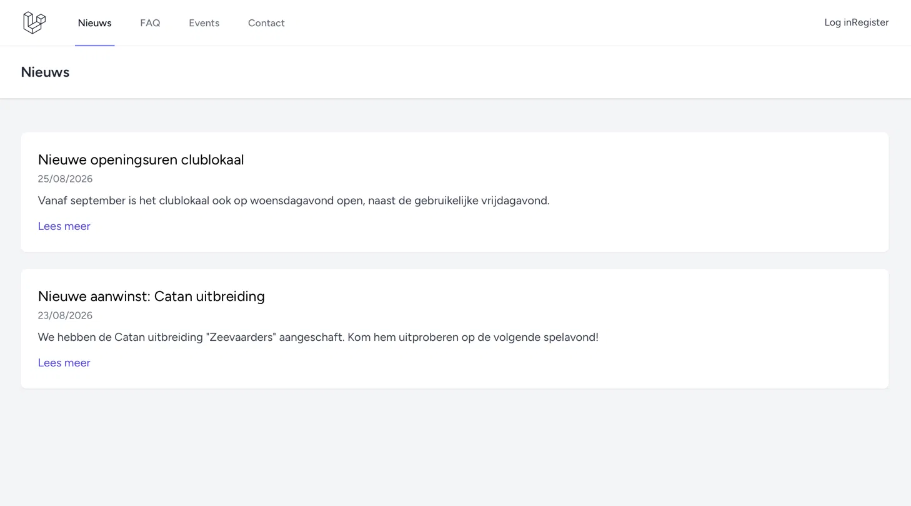
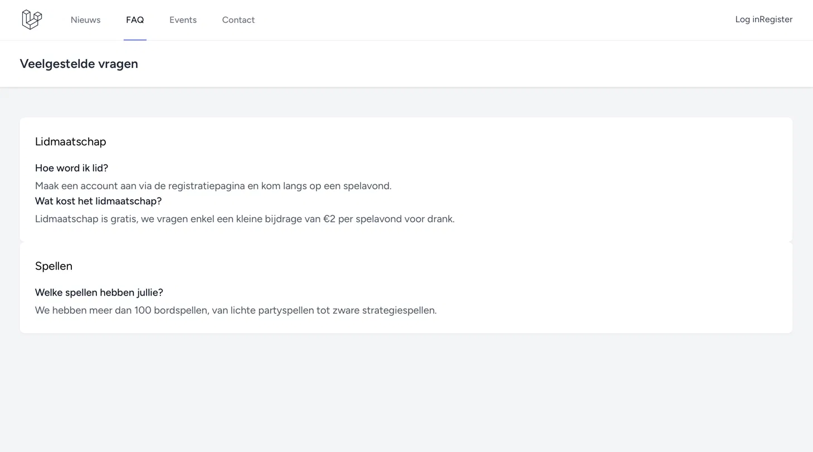
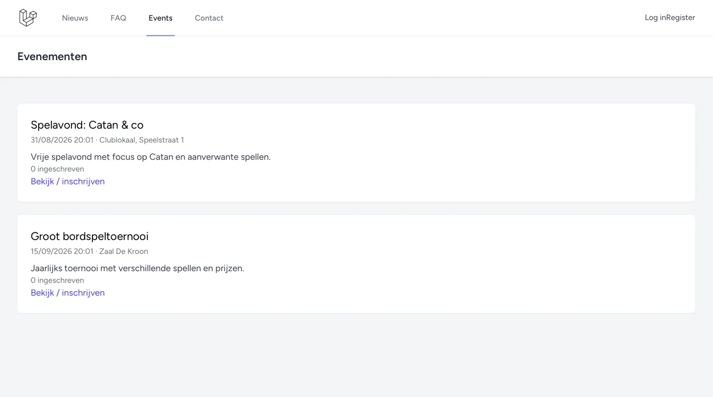
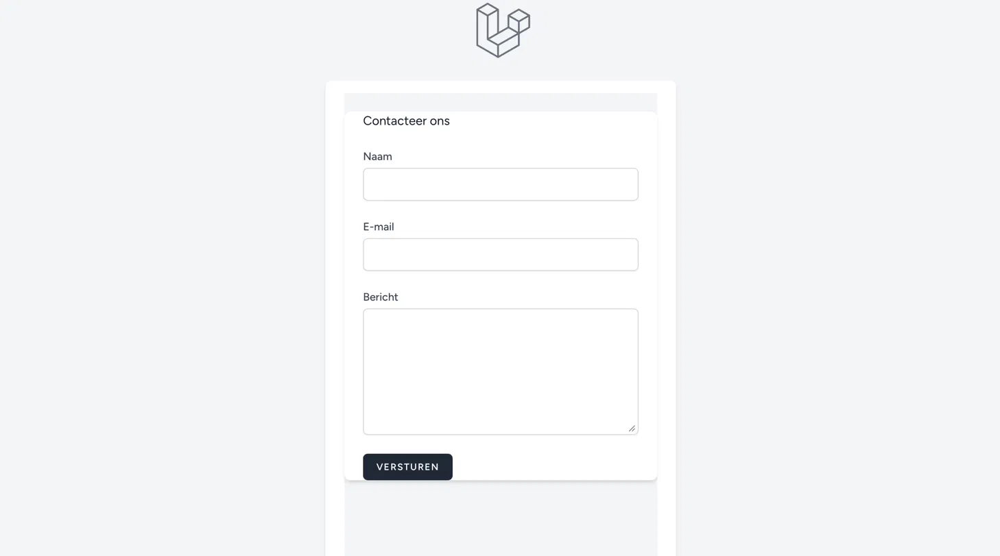

# Bordspelclub

Bordspelclub is een website voor een fictieve bordspellenclub. Het project is gemaakt met **Laravel 13** en heeft zowel een publiek gedeelte voor bezoekers en leden als een beheergedeelte voor de administrator.

Het doel van de website is om leden op een eenvoudige manier informatie te geven over de club, nieuws en evenementen te tonen en contact met de club mogelijk te maken.

## Functionaliteiten

De website bevat onder andere de volgende functies:

* Registreren, inloggen en uitloggen
* Wachtwoord resetten en "onthoud mij"
* Verschillende rollen: gewone gebruiker en admin
* Een profielpagina met username, verjaardag, profielfoto en bio
* Nieuws bekijken via een overzicht en een detailpagina
* Nieuws beheren als admin: toevoegen, aanpassen en verwijderen
* FAQ's bekijken per categorie
* FAQ-categorieën en vragen beheren als admin
* Een contactformulier waarmee bezoekers een bericht kunnen sturen
* Contactberichten worden via e-mail naar de admin gestuurd
* Leden kunnen zich inschrijven en uitschrijven voor evenementen

## Technische uitwerking

Voor het project heb ik gebruikgemaakt van verschillende Laravel-functionaliteiten.

| Onderdeel                          | Waar te vinden                                                    |
| ---------------------------------- | ----------------------------------------------------------------- |
| Eloquent models en relaties        | `app/Models/`                                                     |
| One-to-many: News → Comments       | `News::comments()` in `app/Models/News.php`                       |
| One-to-many: FaqCategory → FaqItem | `FaqCategory::items()` in `app/Models/FaqCategory.php`            |
| Many-to-many: User ↔ Event         | `User::events()` en `Event::participants()`                       |
| Migrations                         | `database/migrations/`                                            |
| Seeders                            | `database/seeders/AdminUserSeeder.php` en `DemoDataSeeder.php`    |
| Controllers                        | `app/Http/Controllers/`                                           |
| Admin middleware                   | `app/Http/Middleware/IsAdmin.php`                                 |
| Middleware registratie             | `bootstrap/app.php`                                               |
| Routes                             | `routes/web.php`                                                  |
| CSRF-bescherming                   | `@csrf` in de formulieren                                         |
| XSS-bescherming                    | Blade escaping met `{{ }}`                                        |
| Client-side validatie              | HTML-attributen zoals `required`, `type="email"` en `type="date"` |
| Blade component                    | `resources/views/components/news-card.blade.php`                  |
| Layouts                            | `resources/views/layouts/app.blade.php` en `guest.blade.php`      |
| Contactformulier e-mail            | `app/Mail/ContactFormSubmitted.php`                               |

### Modellen en relaties

De belangrijkste modellen van het project zijn:

* `User`
* `Profile`
* `News`
* `FaqCategory`
* `FaqItem`
* `Event`
* `Comment`
* `ContactMessage`

Er zijn verschillende soorten relaties gebruikt. Zo heeft een nieuwsbericht meerdere comments en kan een FAQ-categorie meerdere FAQ-items bevatten.

Voor evenementen is er een **many-to-many-relatie** tussen gebruikers en evenementen. Een gebruiker kan dus aan meerdere evenementen deelnemen en een evenement kan meerdere deelnemers hebben.

### Admin en middleware

De website maakt gebruik van een aparte `IsAdmin` middleware. Hiermee wordt gecontroleerd of een ingelogde gebruiker administrator is.

De middleware staat in:

`app/Http/Middleware/IsAdmin.php`

De registratie van de middleware gebeurt in:

`bootstrap/app.php`

Daar wordt de naam `admin` gekoppeld aan de `IsAdmin` middleware. Op deze manier kunnen bepaalde routes alleen toegankelijk worden gemaakt voor admins.

## Installatie

Om het project lokaal te starten, kunnen de volgende stappen worden uitgevoerd.

### 1. Repository clonen

```bash
git clone https://github.com/nisrineaourag1-star/Bordspelclub.git
cd Bordspelclub
```

### 2. Dependencies installeren

```bash
composer install
npm install
```

### 3. `.env` instellen

Maak eerst een `.env` bestand aan en genereer daarna de Laravel application key.

```bash
cp .env.example .env
php artisan key:generate
touch database/database.sqlite
```

### 4. Database instellen

Voer de migrations en seeders uit:

```bash
php artisan migrate:fresh --seed
php artisan storage:link
```

Hierdoor wordt de database aangemaakt en wordt er ook testdata toegevoegd.

### 5. Website starten

Bouw eerst de frontend-assets en start daarna de Laravel server:

```bash
npm run build
php artisan serve
```

De website is daarna beschikbaar op:

http://127.0.0.1:8000

## Testaccounts

Er is een standaard adminaccount voorzien:

**Admin**

* E-mail: `admin@ehb.be`
* Wachtwoord: `Password!321`

Daarnaast zijn er enkele testaccounts beschikbaar:

* `sara@example.com`
* `tom@example.com`
* `nora@example.com`
* `kobe@example.com`

Het wachtwoord voor deze accounts is:

`Password!321`

## Screenshots

### Nieuws


### FAQ


### Evenementen


### Contact


## Gebruikte bronnen

Tijdens het maken van het project heb ik verschillende bronnen gebruikt:

* [Laravel documentatie](https://laravel.com/docs)
* [Laravel Breeze documentatie](https://laravel.com/docs/starter-kits#breeze)
* Lesmateriaal van het vak Backend Web
* AI als hulpmiddel bij het opzoeken, soms uitwerken en controleren van bepaalde onderdelen van het project
